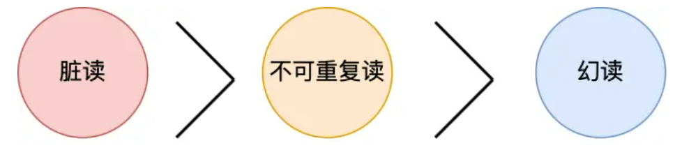
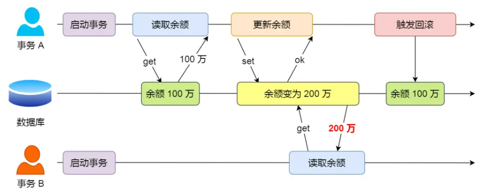
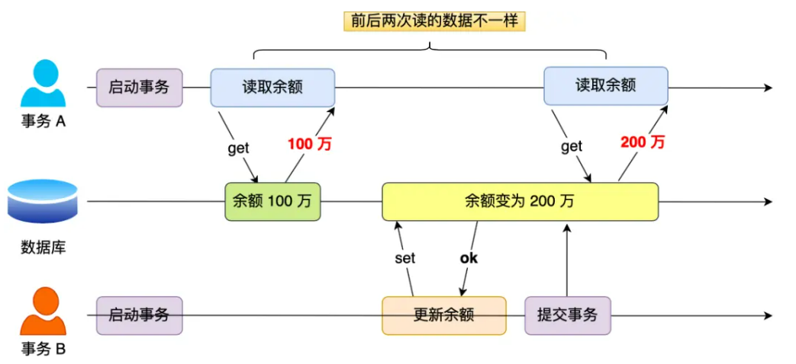
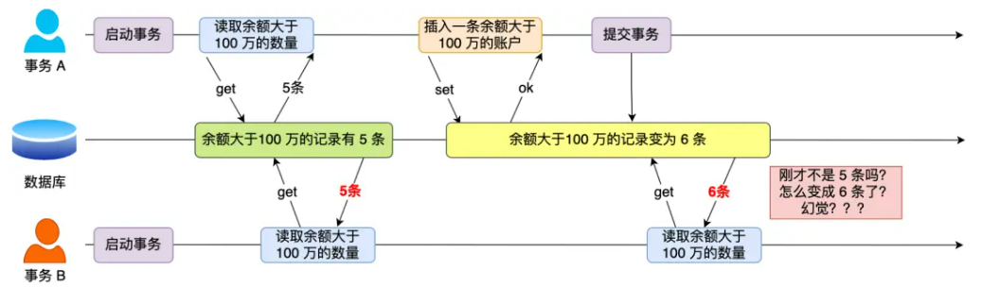

# 事务有哪些特性

1. 原子性：一个事务中的所有操作，要么全部完成，要么全部不完成，不会在哪个中间节点结束，一旦事务在执行过程中发生错误，会被回滚到食物开始前的状态
2. 一致性：事务操作前和操作后，数据满足完整性约束，数据库保持一致性状态
3. 隔离性：数据库允许多个并发事务同时对其数据进行读写和修改的能力，隔离性可以防止多个事务并发执行时产生交叉导致数据之间产生了互相影响
4. 持久性：事务结束后，对数据的修改是永久的，即便系统故障也不会消失

- 持久性通过redo log（重做日志）来保证
- 原子性通过undo log（回归日志）来保证
- 隔离性通过MVCC（多版本并发控制）来保证
- 一致性通过持久性+原子性+隔离性来保证

# 并发事务可能会产生的问题

- 脏读：读到其他事务未提交的数据；
- 不可重复读：前后读取的数据不一致；
- 幻读：前后读取的记录数量不一致。

这三个现象的严重性排序如下：

- 脏读

  一个**【事务】**读到了另一个**【未提交事务修改过的数据】**

  

  如果事务B在事务A提交事务之前拿到数据，那一旦事务A中途有修改或者回滚，那事务B就读取到了错误的数据

- 不可重复度

  一个事务内多次读取同一个数据，如果出现**【前后两次读到的数据不一样】**的情况，就意味着发生了不可重复读

  

- 幻读

  在一个事务内多次查询某个符合查询条件的**【记录数量】**如果出现前后两次查询到的记录数量不一样的情况，就意味着发生**【幻读】**

  

  事务B发现第二次读取到的数据数量与第一次不一样，就感觉发生了幻觉，所以称为幻读

# 事务隔离机制

1. 读未提交

   一个事务还没提交时，它做的变更就能被其他事务看到

2. 读提交

   一个事务提交后，它做的变更才能被其他事务看到

3. 可重复读

   指一个事务执行过程中看到的数据，一直跟这个事务启动时看到的数据是一致的

4. 串行化

   对记录加读写锁，在多个事务对着条记录进行读写操作时，如果发生了读写冲突的时候，后访问的事务必须等前一个事务执行完成，才能继续执行