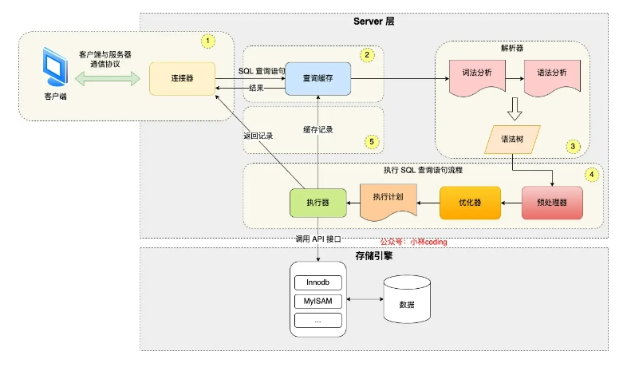
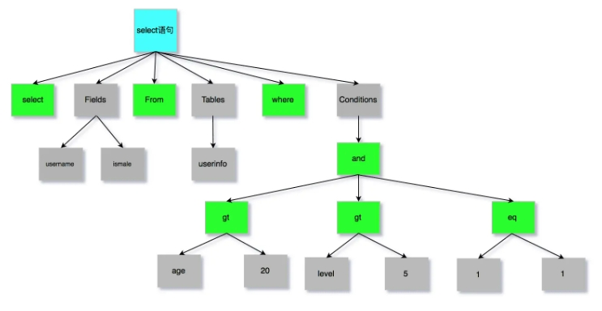
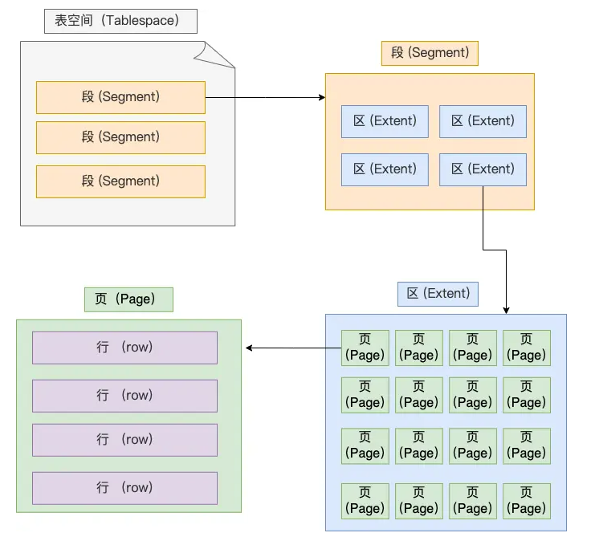
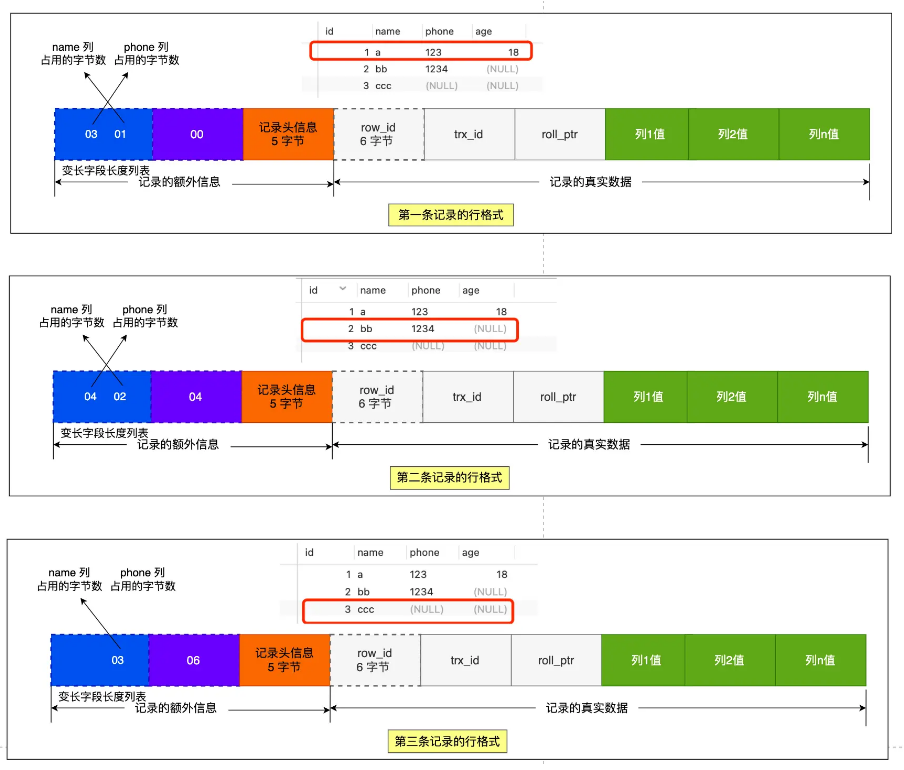
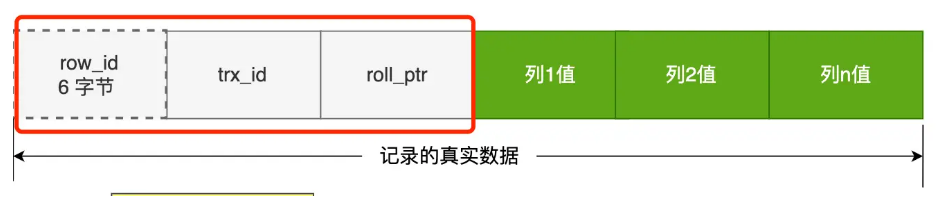
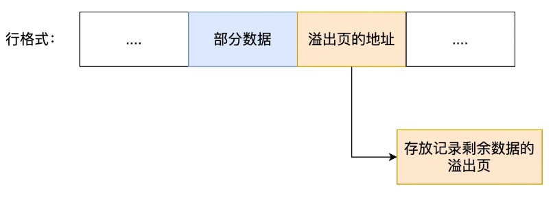
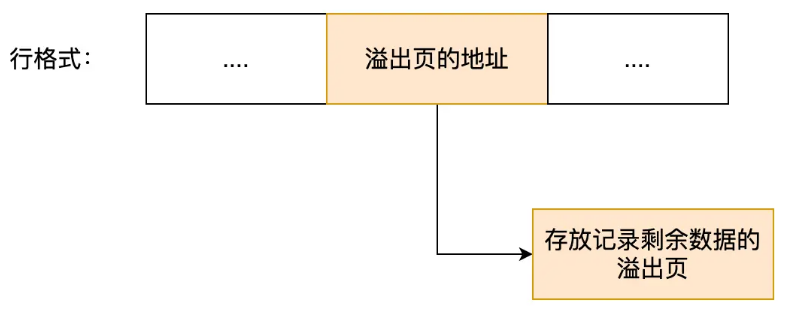

# 一、执行一条SQL语句发生了什么



Mysql的架构分为Server层和存储引擎层

- Server层负责建立连接，分析和执行SQL，包括查询缓存、解析器、优化器、执行器等
- 存储引擎负责数据的存储和提取

## 一条SQL的执行流程

- 客户端先通过连接器建立连接，连接器自会判断用户身份；
- 因为这是一条 update 语句，所以不需要经过查询缓存，但是表上有更新语句，是会把整个表的查询缓存清空的，所以说查询缓存很鸡肋，在 MySQL 8.0 就被移除这个功能了；
- 解析器会通过词法分析识别出关键字 update，表名等等，构建出语法树，接着还会做语法分析，判断输入的语句是否符合 MySQL 语法；
- 预处理器会判断表和字段是否存在；
- 优化器确定执行计划，因为 where 条件中的 id 是主键索引，所以决定要使用 id 这个索引；
- 执行器负责具体执行，找到这一行，然后更新。

### 一、连接器：

验证用户名密码，与mysql数据库建立连接，连接数由`max_connections`参数控制，读去用户权限

### 二、查询缓存：

缓存以key-value形式保存在内存中，key为SQL语句，values为SQL的查询结果，但因为只要有一个表有更新，缓存就会被清掉，很鸡肋，所以在mysql8.0以后删除了查询缓存

### 三、解析SQL：

```mysql
select username from userinfo
```

1. 词法分析：识别sql语句中的关键字（select，from）与非关键字（username，userinfo）

2. 语法分析：根据词法分析结果，语法解析器根据语法规则则，判断sql语句是否满足mysql语法，如果没问题构建sql语法树

   

### 四、执行SQL

1. 预处理阶段：检查表或字段是否存在，将select * 中的 * 符号扩展为表上的所有列
2. 优化阶段：基于查询成本的考虑，选择查询成本最小的执行计划
3. 执行阶段：根据执行计划执行sql语句，从存储引擎中读取记录，返回给客户端

# 二、数据是如何存储的

### 一、表空间文件的结构是怎么样的？



1. 行：

   数据以行的形式存储

2. 页：

   但是数据库的读取如果以行为单位效率太低，因此innoDB以页为单位读取数据，并将其整体存入内存，默认每个页16KB，也就是最多保证16KB的连续存储空间

3. 区： B+树种每一层都是通过双向链表连接的，如果以页为单位分配存储空间，那么链表中相邻的两页之间的物理位置并不是连续的，可能离得非常远，那么查询时就会有大量的随机I/O，增加查询时间。

   那么数据库就提出区的概念，每个区1MB，对于16KB的页来说，连续的64页放到一个区内，这样就使得链表中相邻的页的物理位置也相邻，就能使用顺序I/O

4. 段：

   表空间是由多个段组成，段由多个区组成，段分为：

   1. 索引段：存储B+树非叶子节点的区的集合
   2. 数据段：存放B+树叶子结点的区的集合
   3. 回滚段：存放回滚数据的区的集合

### 二、InnoDB的行格式

InnoDB提供了四种行格式，Redundant、Compact、Dynamic、Compressed行格式

Redundant是5.0之前所使用的的，已被淘汰，5.1以后用Compact格式

Dynamic、Compressed格式都与Compact格式接近，但从5.7以后默认使用Dynamic格式

### 三、Compact格式


1. 记录的额外信息

   1. 变长字段长度列表

      例如Varchar字段就是变长的，在数据库存储时要把变长字段的长度数据也存起来，才能方便我们在读取数据时根据`变长字段长度列表`去读取对应的长度数据

      ```mysql
      CREATE TABLE `t_user` (
        `id` int(11) NOT NULL,
        `name` VARCHAR(20) DEFAULT NULL,
        `phone` VARCHAR(20) DEFAULT NULL,
        `age` int(11) DEFAULT NULL,
        PRIMARY KEY (`id`) USING BTREE
      ) ENGINE = InnoDB DEFAULT CHARACTER SET = ascii ROW_FORMAT = COMPACT;
      ```

      | id   | name | phone  | age    |
      | ---- | ---- | ------ | ------ |
      | 1    | a    | 123    | 18     |
      | 2    | bb   | 1234   | (NULL) |
      | 3    | cc   | (NULL) | (NULL) |

      例：第一条数据

      - name 列的值为 a，真实数据占用的字节数是 1 字节，十六进制 0x01；
      - phone 列的值为 123，真实数据占用的字节数是 3 字节，十六进制 0x03；
      - age 列和 id 列不是变长字段，所以这里不用管。

   2. NULL值列表

      表中的列可能存储NULL值，把NULL值存储到真实数据中比较浪费时间，所以Compact行格式把这些值为NULL的列存储到NULL值列表中

      如果存在允许NULL值的列，则每个列对应一个二进制位(bit)，二进制位按照列的顺序逆序排列

      - 二进制的值为1时，代表该列的值为NULL
      - 二进制的值为0时，代表该列的值不为NULL

      另外，NULL值列表必须用整个8位的字节表示，如果使用二进制位个数不足整数个字节，则在高位补0

   我们把三条记录的 NULL 值列表都填充完毕后，它们的行格式是这样的：

   

   tips： 当列设置为`NOT NULL`时，这时候表里的行格式就不会有`NULL`值列表

   所以在设计数据库表的时候，通常都是建议将字段设置为 NOT NULL，这样可以至少节省 1 字节的空间（NULL 值列表至少占用 1 字节空间）。

   同时「NULL 值列表」的空间不是固定 1 字节的。当一条记录有 9 个字段值都是 NULL，那么就会创建 2 字节空间的「NULL 值列表」，以此类推。

2. 记录头信息

   - `delete_mask`：标识此条数据是否被删除，删除时delete_mask标记为1
   - `next_record`：下一条记录的位置，记录与记录之间是通过链表组织的，此处指向的是下一条记录的`记录头信息`和`真实数据`之间的位置，这样的好处是向左读就是记录头信息，向右读就是真实数据，比较方便，这也是`变长度字段列表`存储顺序逆序的原因
   - `record_type`：标识当前记录的类型，0标识普通记录，1表示B+树非叶子结点记录，2表示最小记录，3表示最大记录

3. 记录真实数据

   

   - row_id:

     当建表没有指定主键或者唯一约束列，那么就没有row_id隐藏字段了。row_id不是必需的，占用6个字节

   - trx_id：

     事务id，表示这个数据是由哪个事务生成的，trx_id是必需的，占6个字节

   - roll_pointer:

   这条记录上一个版本的指针。roll_pointer是必须的，占用7个字节

### 四、varchar(n)中n的最大取值是多少

**MySQL 规定除了 TEXT、BLOBs 这种大对象类型之外，其他所有的列（不包括隐藏列和记录头信息）占用的字节长度加起来不能超过 65535 个字节**。

1. 单字段的情况：当数据库中只有个varchar(n)列且字符集是`Ascii`时，最大字节长度等于65535-`变长字段长度列表`和`NULL列值列表`所占用的字节数

   每个变长字段的「变长字段长度」需要用多少字节表示？具体情况分为：

   - 条件一：如果变长字段允许存储的最大字节数小于等于 255 字节，就会用 1 字节表示「变长字段长度」；

   - 条件二：如果变长字段允许存储的最大字节数大于 255 字节，就会用 2 字节表示「变长字段长度」；

     65535-2-1 = 65532

     当字符集是utf-8时，一个字符占3个字节，varchar(n)的n最大取值就是 65532/3 = 21844

2. 多字段的情况：如果有多个字段的话，要保证所有字段的长度 + 变长字段字节数列表所占用的字节数 + NULL值列表所占用的字节数 <= 65535。

### 五、行溢出后，Mysql如何处理

Mysql中磁盘和内存交互的基本单位是页，一个页是16KB，也就是16384字节，而一个Varchar最多可存储65532个字节，如果是TEXT、BLOB可能存储更多的数据，这时一个页可能就存不了一条数据，这个时候就会发生行溢出，多的数据会存到另外的`溢出页`中

- Compact格式对溢出页的处理：



- Compressed和Dynamic这两个行格式和compact格式的主要不同就是对于溢出页的处理，compact格式会存储部分数据，在真实数据处用20字节存储指向溢出页的地址，从而找到剩余数据所在的页，而Compressed和Dynamic格式不会存储部分数据，只在真实数据处用20字节的指针指向溢出页，而实际的数据都存在溢出页中


  
