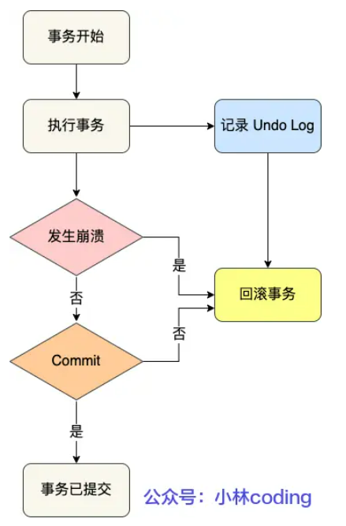
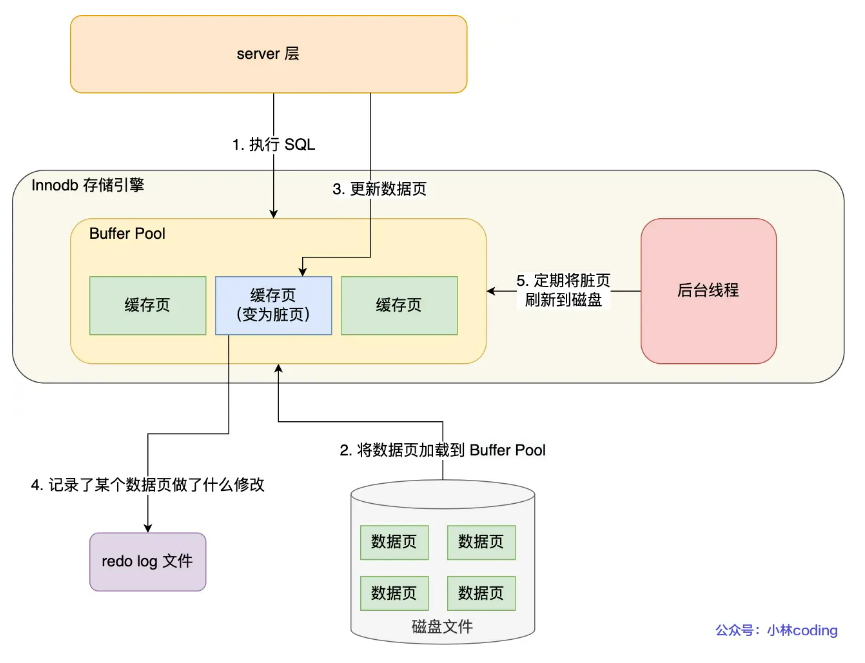

# Mysql日志

## 一、undo log

每次执行事务的过程中，都记录下回滚需要的信息到一个日志里，那么在事务执行中途发生了Mysql崩溃时，就可以通过日志回滚到事务之前的数据

实现这一机制的就是**undo log(回滚日志)它保证了事务ACID特性中的原子性**



一条记录的每一次更新操作产生的undo log格式都有一个roll_pointer指针和一个trx_id事务id

- 通过trx_id可以知道该记录是被哪个事务修改的
- 通过roll_pointer指针可以将这些undo log串成一个链表，这个链表就被称为版本链

### 版本链示意图：


### undo log的作用

1. 实现事务回滚，保障事务的原子性

   事务处理过程中，如果出现了错误或者执行了ROLLBACK语句，**Mysql可以利用undo log中的历史数据将数据恢复到事务开始之前的状态**。

2. 实现MVCC(多版本并发控制)关键因素之一

   **多版本控制MVCC是通过ReadeView + undo log实现的**。undo log为每条记录保存多份历史数据，Mysql在执行快照读时，会根据事物的ReadView里的信息，顺着**undo log版本链**找到满足其可见性的记录

## 二、redo log

redo log就是物理日志，记录了某个数据页做了什么修改，

```
比如：对XXX表空间中的YYY数据页ZZZ偏移量的地方做了AAA更新，每当执行一个事务就会产生这样的一条或多条物理日志。
```

在事务提交时，只要先将redo log持久化到磁盘即可，当系统崩溃时，Mysql重启，可以根据redo log的内容，将所有数据恢复到最新状态

### redo流程

为防止断点导致数据丢失的问题，当有一条记录需要更新时，InnoDB引擎会先更新内存(脏页)，然后将本次对这个页的修改结果以redo log的形式记录下来，这个时候更新就算完成了。后续，innoDB引擎会在适当的时候，由后台线程将缓存在Buffer Pool的脏页刷新到磁盘里，这就是**WAL技术**

WAL技术是指，Mysql的写操作并不是立刻写到磁盘上，而是先写日志，然后在合适的时间再写到磁盘上



### redo log和undo log的区别

- **redo log**记录了此次事务完成后的数据状态，记录的是**更新之后**的值
- **undo log**记录了此次事务开始前的状态，记录的是**更新之前**的值

事务提交之前发生了崩溃，重启后通过undo log回滚事务事务提交之后发生了崩溃，重启后通过redo log恢复事务


有了redo log，再通过WAL技术，InnoDB就可以保证即使数据库发生异常重启，之前已提交的记录都不会丢失，这个叫**crash-safe(崩溃恢复)**，可以看出**redo log保证了事务四大特性中的持久性**

### redo log顺序写

```tex
redo log要写到磁盘，而数据也要写到磁盘，那为什么要有redo log呢
```

写入redo log是追加操作，写入磁盘是顺序写，而写入数据需要找到写入位置再写入磁盘，所以磁盘操作是随机写

所以说WAL技术的另一个优点：Mysql的写操作从磁盘的随机写变成了顺序写，提升了语句的执行性能

### redo log的作用

1. 实现事物的**【持久性】**，让Mysql有crash-safe的能力，能够保证Mysql在任何时段突然崩溃，重启后之前已提交的记录都不不会丢失
2. **将写操作由随机写变为了顺序写**，提升Mysql写入磁盘的性能

事实上redo log也不是直接写入磁盘，因为这样会产生大量I/O操作，而且磁盘的运行速度远慢于内存，每次产生一条redo log时会先写入redo log buffer中

## 三、bin log

`binlog`文件是为了记录所有数据库表结构变更和表数据修改的日志，不会记录查询类的操作

```
为什么有了 binlog， 还要有 redo log？
```

因为`Innodb`引擎只依靠`binlog`没有crash-safe能力，所以`InnoDB`使用`redo log`实现`crash-safe`能力。

redo log和bin log有什么区别

1. 适用对象不同：
   - bin log是mysql的server层实现的日志，所有引擎都可以使用
   - redo log是innodb引擎实现的日志
2. 文件格式不同
3. 写入方式不同
   - binlog是追加写，写满一个文件，就创一个新的文件继续写，不会覆盖以前的日志，保存的是全量的日志。
   - redolog是循环写，日志空间大小固定，全部写满就从头开始写，保存未被刷入磁盘的脏页日志
4. 用途不同
   - binlog用于备份恢复，主从复制
   - redolog用于掉电等故障恢复

```
如果不小心整个数据库的数据被删除了，能使用 redo log 文件恢复数据吗？
```

答：**不能，只能用binlog进行恢复**

因为redo log文件是循环写，会边写边擦除日志，只记录未被刷入的数据的物理日志，已经刷入磁盘的数据都会从redo log文件里擦除

bin log保存的是全量日志，也就是保存了所有数据的变更情况，理论上只要记录在bin log上的数据，都可以恢复，所以如果不小心整个数据库被删除了，只用用binlog进行恢复

### 3.binlog主从复制

数据库的主从复制主要依赖于binlog，Mysql上的所有变化都以二进制形式保存在磁盘上，主从复制就是将数据传输到从库上

#### 具体流程

1. 写入binlog

   主库在收到提交事务时，先写入binlog，在提交事务，再更新存储引擎中的数据，事务提交完成后，返回客户端“操作成功”的响应

2. 同步binlog

   从库创建一个专门的I/O线程，连接主库的log dump线程，来接收主库的binlog日志，再把binlog信息写入relay log的中继日志里，再返回给主库“复制成功”的响应

3. 回放binlog

   从库会创建一个用于回放binlog的线程，去读relay log中继日志，然后回放binlog更新存储引擎中的数据，实现主从复制

#### 从库是不是越多越好

不是，因为从库数量增加，从库上来的I/O线程也比较多，主库也要创建同样多的`log dump`线程来处理复制的请求，对主库资源消耗比较高，同时还受限于从库的网络带宽

，一般一个主库跟2~3个从库

#### 主从复制的方式

1. 同步复制

   Mysql主库提交的事务的线程要等待所有从库的复制成功响应，才返回客户端结果。这样一是性能很差要主库等待所有从库的响应，二是主库和多个从库有一个出现问题，都会影响业务

2. 异步复制（默认）

   Mysql主库提交事务的线程并不会等待binlog同步到各从库，就返回客户端结果，这种模式一旦主库宕机，数据就发生丢失

3. 半同步复制

   Mysql5.7之后增加的一种复制方式，事务不需要等待所有的从库复制成功响应，只要一部分成功响应回来就行，比如一从二主的集群，只要数据成功复制到任何一个从库上，主库的事务线程就可以返回给客户端。

   这种半同步方式，兼顾异步复制和同步复制的优点，**即使出现主库宕机，至少还有一个从库有最新的数据，不存在数据丢失的风险**

   #### binlog刷盘

   事务执行时，先把日志写到Binlog cache，事务提交时，再把binlog cache写到binlog文件中。

## Buffer Pool