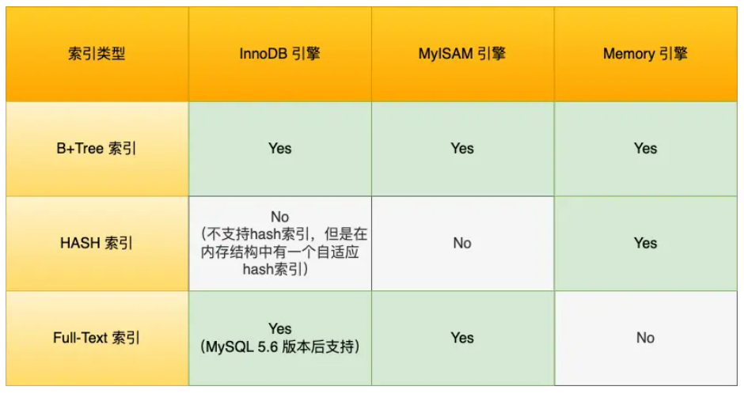
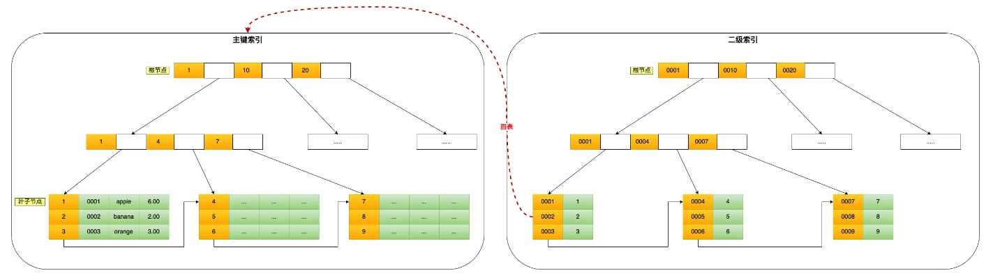
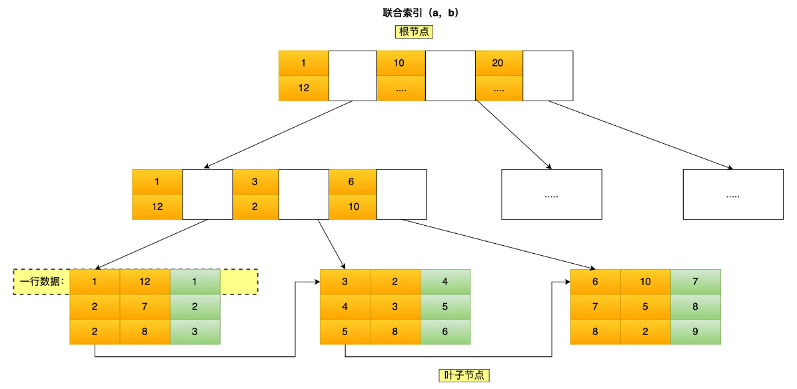

- # 一、索引

  ## 按照四个维度将索引分类

  - 按数据结构分类：B+tree索引、Hash索引、Full-text索引
  - 按物理存储分类：聚簇索引（主键索引）、二级索引（辅助索引）
  - 按字段特性分类：主键索引、唯一索引、普通索引、前缀索引
  - 按字段个数分类：单列索引、联合索引

  ### 1.按数据结构分类

  

  #### MyISAM和InnoDB的区别

  InnoDB和MyISAM都支持B+树索引，但是它们数据的存储结构实现放不一样

  - InnoDB：B+树索引的叶子节点保存数据本身
  - MyISAM：B+树索引的叶子节点保存数据的物理地址

  #### InnoDB存储引擎会根据不同的场景选择不同的列做为索引

  - 如果有主键，默认会使用主键作为聚簇索引的索引键（key）
  - 如果没有主键，就选择第一个不包含NULL值的唯一列作为聚簇索引的索引键（key）
  - 如果以上两个都没有，InnoDB将会自动生成一个隐式自增id列作为聚簇索引的索引键（key）

  其他索引都属于辅助索引，也被成为二级索引或非聚簇索引。创建的主键索引和二级索引默认使用的是B+Tree索引

  

  #### 为什么选用B+树作为InnoDB索引结构

  1. B+ Tree 对比B Tree

     B+ Tree只在叶子结点存储数据，而B树的非叶子结点也要存储数据，所以B+树的单个节点的数据量更小，在相同的磁盘I/O下，就能查询到更多的结点

     另外B+Tree叶子节点采用的是双链表连接，更适合做基于范围的顺序查找

  2. B+ Tree对比二叉树

     B+ Tree允许的最大节点个数无限制，这样就保证了，技术数据达到千万级别，B+ Tree的高度依然维持在3~4层，也就是一次数据查询操作只需要3~4次磁盘I/O

     二叉树的每个父节点只能有两个子节点，树太高，I/O次数高

  3. B+ Tree对比Hash

     hash在做等值查询时速度极快，搜索复杂度为O(1)，但是Hash表不适合做范围查询

  ### 2.按物理存储分类

  - 聚簇索引（主键索引）

  主键索引的B+ Tree的叶子节点存放的是实际数据，所有完整的用户记录都存放在主键索引的B+ Tree的叶子节点

  - 二级索引（辅助索引、非聚簇索引）

  二级索引的B+ Tree的叶子节点存放的是主键值，而不是实际数据

  所以在查询时使用了二级索引，如果查询的数据能在二级索引里查询的到，那么就不需要回表，这个过程就是覆盖索引，如果查询的数据不在二级索引里，就会先检索二级索引，找到对应的叶子节点，获取到主键值后，然后再检索主键索引，就能查询到数据了，这个过程就是回表。

  ### 3.按字段特性分类

  - 主键索引

    主键索引就是建立在主键字段上的索引，通常在创建表的时候一起创建，一张表最多有一个主键索引，索引列的值不允许有空值

  - 唯一索引

    建立在UNIQUE字段上的索引，一张表可以有多个唯一索引，索引列的值必须唯一，但是允许有空值

  - 普通索引

    建立在普通字段上的索引，既不要求字段为主键、也不要求字段为UNIQUE

  - 前缀索引

    对字符类型字段的前几个字符建立的索引，而不是在整个字段上建立的索引，前缀索引可以建立在字段类型为char、varchar、binary、varbinary。

    使用前缀索引的目的是为了减少索引占用的存储空间，提升查询效率

  ### 4.按字段个数分类

  - 建立在单个列上的成为单列索引，比如主键索引
  - 建立在多个列上的索引成为联合索引

  联合索引

  ```mysql
  CREATE INDEX index_a_b_c ON product(a, b, c);
  ```

  联合索引的查找遵循最左匹配原则，也就是按照最左优先的方式进行索引的匹配。

  

  先筛选出`a`正确的列，再去对`b,c`字段进行比较

  但是有一个问题，像以下场景因为不符合最左匹配原则，所以就无法匹配上联合索引，联合索引就会失效

  - where b = 2;
  - where b = 2 and c = 3;
  - where c = 3

  上面这些查询条件之所以会失效，是因为（a,b,c）联合索引，先按a排序，a相同的情况下再按b排序，b相同的情况再按c排序。所以b和c是全局无序的，局部相对有序，这属于没有遵循最左匹配原则，无法使用索引。

  比如 a 等于 2 的时候，b 的值为（7，8），这时就是有序的，这个有序状态是局部的，因此，执行`where a = 2 and b = 7`是 a 和 b 字段能用到联合索引的，也就是联合索引生效了。

  联合索引的最左匹配原则，在遇到范围查询（如 >、<）的时候，就会停止匹配，也就是范围查询的字段可以用到联合索引，但是在范围查询字段的后面的字段无法用到联合索引。注意，对于 >=、<=、BETWEEN、like 前缀匹配的范围查询，并不会停止匹配

  ## 索引下推

  - 在Mysql 5.6之前，只能取到主键值后去一个一个回表，到主键索引上找数据行，再对比b字段值
  - 而Mysql 5.6之后引入**索引下推**，可以在联合索引遍历过程中，对联合索引包含的字段先做判断，直接过滤掉不满足条件的记录，减少回表次数

  当explain sql时，出现了Extra为`using index condition`，那就代表使用了索引下推

  ## 索引区分度

  建立联合索引时，字段顺序对索引效率影响也很大，越靠前的字段用于索引过滤的概率越高，所以**在建立联合索引时，把区分度大的字段排在前面，这样区分度大的字段更有可能被更多SQL使用到。**

  

  比如，性别的区分度就很小，不适合建立索引或不适合排在联合索引列的靠前的位置，而 UUID 这类字段就比较适合做索引或排在联合索引列的靠前的位置。

  因为如果索引的区分度很小，假设字段的值分布均匀，那么无论搜索哪个值都可能得到一半的数据。在这些情况下，还不如不要索引，因为 MySQL 还有一个查询优化器，查询优化器发现某个值出现在表的数据行中的百分比（惯用的百分比界线是"30%"）很高的时候，它一般会忽略索引，进行全表扫描。

  ## 索引的缺点

  - 需要占用物理空间，数量越大，占用空间越多
  - 创建索引和维护索引需要耗费时间，时间随着数据量的增加而增大
  - 会降低表的增删改效率，因为每次增删改，B+树为了维护索引有序性，都需要进行动态维护

  ## 什么时候需要索引

  - 字段有唯一性限制，比如商品编码
  - 经常用于where查询的条件的字段，这样可以提升整个表的查询速度，如果需要查询的列较多，可以建立联合索引
  - 经常用`与Group by`和`Order by`的字段，这样查询时就不需要再去做一次排序了

  ## 什么时候不需要索引

  - 经常更新的列
  - order by、group by、 where里用不到的列
  - 字段中存在大量重复数据的列，比如性别，当单个字出现频率超过一定比例时，一般会忽略索引进行全盘扫描
  - 表数据太少的时候，不需要创建索引
  - 经常更新的字段不用创建索引，比如账户余额，因为字段频繁修改，就需要不断维护b+树的有序性，那么就需要频繁的重建索引，这个过程会影响数据库性能

  ## 优化索引的方法

  - 前缀索引优化
  - 覆盖索引优化
  - 主键索引最好是自增的
  - 防止索引失效

  ### 前缀索引优化

  对某个字段中字符串的前几个字符建立索引，目的是为了减小索引字段大小，有效提供索引的查询速度

  但是前缀索引也存在一些局限性

  - order by无法使用前缀索引
  - 无法把前缀索引用作覆盖索引

  ### 覆盖索引优化

  覆盖索引是指sql中query的所有字段，在索引树上都能一次性找到，避免回表操作，可以建立一个联合索引，包含所有需要查询的字段，有效减少I/O操作

  ### 主键索引最好是自增的

  - 如果使用非自增主键

     每次插入主键的索引值都是随机的，每次插入新数据时，就可能会插入到现有页的某个位置，然后不得不把数据进行移动排序，甚至移动到别的页，这种情况通常称为**页分裂**，页分裂可能会造成大量的内存碎片，导致索引结构不紧凑，从而影响查询效率。

  - 如果使用自增主键

     每次插入都会按顺序添加到当前索引节点的位置，不需要移动已有的数据，当页面写满，就开辟一个新页，因此插入效率很高

    另外主键字段长度不要太大， 因为二级索引的叶子节点存放的是主键值，主键字段长度越小，二级索引占用的空间也就越小

  ### 索引列最好设置为not null

  - 原因1：索引列设置为NULL会导致优化器在索引选择的时候更加复杂，更加难以优化，因为可为NULL的列会使索引、索引统计和值比较都更复杂，比如进行索引统计的时候，count会忽略NULL值得行
  - 原因2：NULL值是一个没意义的值，但是它会占用物理空间，innodb存储记录时，如果表中存在允许为NULL的字段，name行格式就会用1字节空间存储NULL值列表

  # 二、索引失效的情况

  1. 使用左或左右模糊查询时，比如`like %li`或者`like %li%`

  2. 对索引列做计算、函数、类型转换操作，都会引起索引失效

     因为索引保存的是索引字段的原始值，而不是经过函数计算、数学运算后的值

  3. 对索引进行隐式转换

  4. 遵循最左匹配原则

     联合索引生效条件是最左侧字段先新进行索引查找，第一列字段先排序，第一列字段相同时再对第二列进行排序

  5. `where` 子句中，如果`Or`前条件列加了索引，后面没加，索引会失效

  # 三、explain执行计划

  | 参数          | 含义                                       |
  | ------------- | :----------------------------------------- |
  | possible_keys | 字段表示可能用到的索引                     |
  | key           | 实际用到的索引，这一些为NULL，表示没用索引 |
  | key_len       | 索引的长度                                 |
  | rows          | 扫描的数据行数                             |
  | type          | 数据扫描类型                               |
  | extra         | 额外的指标                                 |

  **type**扫描类型参数

  | 扫描类型 | 含义                             |                                                    |
  | -------- | -------------------------------- | -------------------------------------------------- |
  | All      | 全表扫描                         |                                                    |
  | index    | 全索引扫描                       |                                                    |
  | range    | 索引范围扫描                     | 一般是where子句中使用了`<、>、in、between`等关键词 |
  | ref      | 非唯一索引扫描                   | 查找结果仍然有多条，还需要小范围查询               |
  | eq_ref   | 唯一索引扫描                     | 使用主键或唯一索引时产生，通常使用在多表联查       |
  | const    | 结果只有一条的主键或唯一索引扫描 | 使用主键或唯一索引时产生，const是与常量比较        |

  表中未**执行效率从低到高的顺序**

  **extra结果参考指标**

  - using filesort：查询语句中包含group by操作，而且无法利用索引完成排序的操作的时候，这时不得不选择相应的排序算法进行们甚至可能通过文件排序，效率是很低的
  - using temporary: 使用了临时表保存中间结果，Mysql在对查询结果进行排序时使用临时表，常见于排序order by和分组排序group by，效率低
  - using index： 即覆盖索引，所有数据在索引即可全部获得，不需要再到表中取数据

  # 四、B+树

  ## B树和B+树有什么差异

  - 叶子结点存放实际数据（索引+记录），非叶子节点只会存放索引
  - 所有索引都会在叶子节点出现，叶子节点之间构成一个有序链表
  - 非叶子节点的索引也会同时存在在子节点中，并且是在子节点中所有的索引最大或最小
  - 非叶子节点有多少个子节点就会有多少个索引

  ## B树存储结构和B+存储结构的性能区别

  ### 单点查询时

   B+树的非叶子节点不存放实际的记录数据，仅存放索引，因此数据量相同的情况下，相比存储即存索引又存记录的 B 树，B+树的非叶子节点可以存放更多的索引，**因此 B+ 树可以比 B 树更「矮胖」，查询底层节点的磁盘 I/O次数会更少**。

  ### 插入和删除效率

   B+树的插入和删除，插入可能存在节点的分裂（如果节点饱和），但是最多只涉及树的一条路径。而且 B+ 树会自动平衡，不需要像更多复杂的算法，类似红黑树的旋转操作等。因此，**B+ 树的插入和删除效率更高**。

  ### 范围查询

   B+树所有叶子结点间用一个链表进行连接，这样的设计对范围查找非常有帮助，而B树只能通过树的遍历来完成范围查找，这会涉及多个节点的磁盘I/O操作。范围查询效率低，

  # 关于 count()计数的效率问题

  - count(1)

    InnoDB 循环遍历聚簇索引（主键索引），将读取到的记录返回给 server 层，**但是不会读取记录中的任何字段的值**，因为 count 函数的参数是 1，不是字段，所以不需要读取记录中的字段值。

  - count(*)

    **count(`*`) 其实等于 count(`0`)**，也就是说，当你使用 count(`*`) 时，MySQL 会将 `*` 参数转化为参数 0 来处理。所以，**count(\*) 执行过程跟 count(1) 执行过程基本一样的**，性能没有什么差异。

  - count(主键)

    如果表里只有主键索引，没有二级索引时，那么，InnoDB 循环遍历聚簇索引，将读取到的记录返回给 server 层，然后读取记录中的 id 值，就会 id 值判断是否为 NULL，如果不为 NULL，就将 count 变量加 1。

  - count(字段)

    采用全表扫描的方式来计数，所以它的执行效率是比较差的。

  ## 如何优化count(*)

  count统计记录个数，效率很差，因为他采用全表扫描的方式来统计

  1. 为字段建立二级索引，因为在count执行时，优化器会优先选择二级索引进行扫描
  2. 额外的表去存储要查询的表的行数，每次插入删除需要维护该表
  3. 常用的表存到redis缓存中，先通过缓存拿到count
  4. 使用explain可以快速获取数据行数