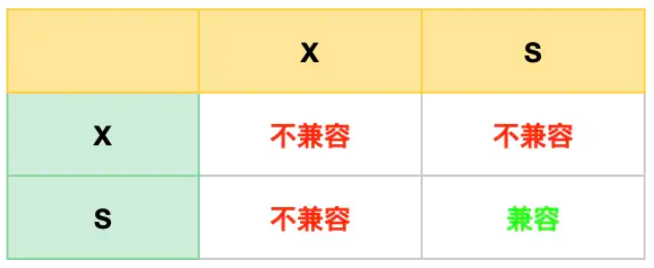
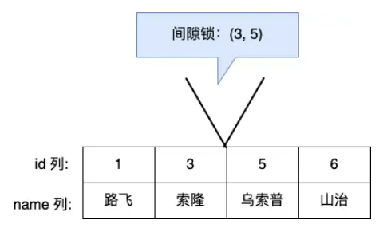
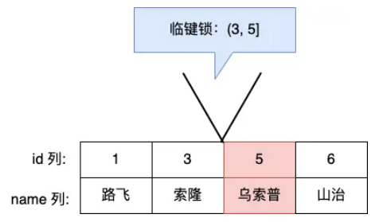

# Mysql有哪些锁

## 全局锁

使用全局锁后，整个数据库就处于只读状态了，这时其他线程执行以下操作，都会被阻塞

- 对数据文档增删改操作，比如insert、delete、update等语句
- 对表结构的更改操作，比如alter table、drop table等语句

全局锁的**主要应用场景是全库逻辑备份**，加锁后在备份数据库期间，不会因为数据或表结构的更新而出现备份文件的数据与预期的不一样

- 加全局锁有什么缺点呢：

加全局锁以为整个数据库仅可读状态，在备份期间业务只能读数据，而不能更新数据，这样会造成业务停滞

- 如何解决该问题：

InnoDB默认隔离级别正是**可重复读**，那么在备份数据库前开启事务，会创建read view，然后事务整个执行期间都会使用这个read view，备份期间就可以依然对数据进行更新操作

## 表级锁

### 表锁

- 共享读锁

  可读，但阻塞包括本线程在内的所有写操作

- 共享写锁

  既阻塞读操作也阻塞写操作

不过尽量避免在使用 InnoDB 引擎的表使用表锁，因为表锁的颗粒度太大，会影响并发性能

### 元数据锁(MDL)

我们不必显式的使用MDL，因为我们在做数据库操作时，会自动为这个表加上MDL：

- 对一张表进行CRUD时，加MDL读锁
- 对一张表结构变更操作时，加MDL写锁

MDL是防止用户对表进行CRUD操作时，防止其他线程对这个表结构做变更

### 意向锁

1. 在使用 InnoDB 引擎的表里对某些记录加上「共享锁」之前，需要先在表级别加上一个「意向共享锁」；
2. 在使用 InnoDB 引擎的表里对某些纪录加上「独占锁」之前，需要先在表级别加上一个「意向独占锁」；

如果没有「意向锁」，那么加「独占表锁」时，就需要遍历表里所有记录，查看是否有记录存在独占锁，这样效率会很慢。

那么有了「意向锁」，由于在对记录加独占锁前，先会加上表级别的意向独占锁，那么在加「独占表锁」时，直接查该表是否有意向独占锁，如果有就意味着表里已经有记录被加了独占锁，这样就不用去遍历表里的记录。

所以，**意向锁的目的是为了快速判断表里是否有记录被加锁**。

### AUTO-INC锁

表里的主键通常都会设置成自增的，这是通过对主键字段声明 `AUTO_INCREMENT` 属性实现的。

之后可以在插入数据时，可以不指定主键的值，数据库会自动给主键赋值递增的值，这主要是通过 **AUTO-INC 锁**实现的。

AUTO-INC 锁是特殊的表锁机制，锁**不是再一个事务提交后才释放，而是再执行完插入语句后就会立即释放**。

**在插入数据时，会加一个表级别的 AUTO-INC 锁**，然后为被 `AUTO_INCREMENT` 修饰的字段赋值递增的值，等插入语句执行完成后，才会把 AUTO-INC 锁释放掉。

那么，一个事务在持有 AUTO-INC 锁的过程中，其他事务的如果要向该表插入语句都会被阻塞，从而保证插入数据时，被 `AUTO_INCREMENT` 修饰的字段的值是连续递增的。

但是， AUTO-INC 锁再对大量数据进行插入的时候，会影响插入性能，因为另一个事务中的插入会被阻塞。

因此， 在 MySQL 5.1.22 版本开始，InnoDB 存储引擎提供了一种**轻量级的锁**来实现自增。

一样也是在插入数据的时候，会为被 `AUTO_INCREMENT` 修饰的字段加上轻量级锁，**然后给该字段赋值一个自增的值，就把这个轻量级锁释放了，而不需要等待整个插入语句执行完后才释放锁**。

## 行级锁

共享锁（S锁）满足读读共享，读写互斥。独占锁（X锁）满足写写互斥、读写互斥。

行级锁主要分为三类：

- Record Lock 记录锁，仅仅把一条记录锁上
- Gap Lock间隙锁，锁定一个范围，不包含记录本身
- Next-Key Lock: Record Lock+Gap Lock的组合，锁定一个范围，包括巨记录本身

### Record Lock

**记录锁**，锁定一条记录。记录锁有S锁和X锁之分

- 当一个事务对一条记录加了S型记录锁，其他事务可以继续加S锁，但不能加X锁
- 当一个事务对一条记录加了X型记录锁，其他事务既不可以加读锁也不可以加写锁

### Gap Lock

**间隙锁**，只存在于可重复读隔离级别，目的是为了解决可重复读隔离机制下的幻读现象

假设，表中有一个范围 id 为（3，5）间隙锁，那么其他事务就无法插入 id = 4 这条记录了，这样就有效的防止幻读现象的发生。

### Next-Key Lock

**临时锁**，是Record Lock+Gap Lock的组合，锁定一个范围，并且锁定记录本身

假设，表中有一个范围 id 为（3，5] 的 next-key lock，那么其他事务即不能插入 id = 4 记录，也不能修改 id = 5 这条记录。

 