# 一、Redis 

redis是一种基于内存的数据库，对数据读写操作都是在内存中进行的，所以读写速度非常快

## 为何使用redis作为Mysql的缓存

1. redis具备高性能

   假如用户第一次访问Mysql中的某些数据，这个过程会比较慢，因为是从硬盘中读取的，将改用户访问的数据缓存到Redis中，这样下次访问就可以从Redis缓存中直接拿

2. redis具备高并发

   单台设备的Redis的QPS是Mysql的10倍，redis单机的QPS能够轻松过10万，而Mysql的单机QPS很难过1万

# 二、Redis常用的数据类型

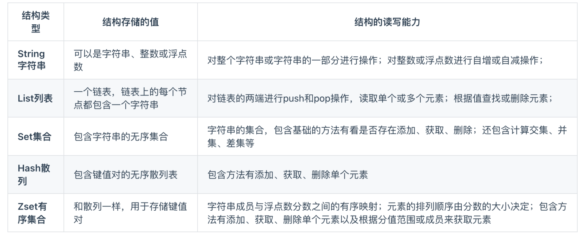

常见应用场景

- String

  缓存对象、常规计数、分布式锁、共享Session

- List

  消息队列（但有两个问题1.生产者需要自行实现全局唯一ID；2.不能以消费组形式消费数据）

- Hash

  缓存对象、购物车

- Set

  聚合计算（交集并集差集），比如点赞、共同关注、抽奖活动等

- Zset

  排序场景，比如排行榜、粉丝列表、关注列表


## 1.string

### 底层结构

底层结构是**SDS（简单动态字符串）**，相比于C语言原生字符串

- SDS不仅可以保存文本，还可以保存二进制数据，比如图片、视频、声音等
- SDS获取字符串长度的时间复杂度是O(1)，因为SDS结构里有len属性去记录字符串长度
- SDS在拼接字符串时会检查SDS空间是否满足要求，如果不够会自动扩容，所以拼接字符串不会造成缓冲区溢出问题

### 应用场景

1. 缓存对象

   直接存储整个对象JSON等

2. 常规计数

   因为Redis是单线程的，所以执行命令的过程是原子的，因此string数据类型适合计数场景，比如计算访问次数、点赞、转发、库存数量等

3. 分布式锁

   使用set命令中的的NX参数实现分布式锁

   - key不存在，显示插入成功，可以用来表示加锁成功
   - key存在，则会显示插入失败，可以用来表示加锁失败

   ```
   set lock_key unique_value NX PX 10000
   ```

   - lock_key就是key键
   - unique_value是客户端生成的唯一的标识
   - NX代表只在lock_key不存在，才对lock_key进行设置操作
   - PX 10000标识设置lock_key的过期时间为10s，这是为了避免客户端发生异常而无法释放锁

   而解锁的过程就是将lock_key键删除，但不能乱删，要保证执行操作的客户端就是加锁的客户端，所以解锁时要判断锁的unique_value是否为加锁客户端，是的话，才将lock_key键删除。

   那么解锁是有两步操作，这时就需要lua脚本来保证解锁的原子性，因为Redis在执行Lua脚本时，可以以原子性的方式执行，保证了锁释放操作的原子性

   ```go
   // 释放锁时，先比较 unique_value 是否相等，避免锁的误释放
   if redis.call("get",KEYS[1]) == ARGV[1] then
       return redis.call("del",KEYS[1])
   else
       return 0
   end
   ```

4. 共享session信息

   通常我们在开发后台管理系统时，会使用session来保存用户的会话登陆状态， 我们借助Redis对所有服务的session信息进行统一的存储于管理，因此无论请求发送到哪台服务器，服务器都会去同一个Redis获取相关的session信息，这样就解决了分布式系统下Session存储的问题

   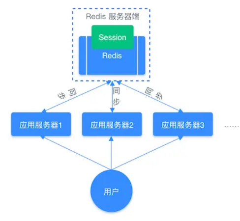

## 2.list

List是一个简单的字符串列表，按照插入顺序排序，可以从头部或尾部向LIst列中添加元素

列表的最大长度为2^32-1,也就是每个列表支持超过40亿个元素

### 底层实现

List类型的底层数据结构是**压缩列表或双向链表**

- 当元素个数小于512个，所有值小于64字节的话，Redis使用压缩链表作为List的底层结构
- 如果不满足以上条件，会使用双向链表作为List的底层结构

**但在Redis3.2版本之后，List数据类型的底层结构就只由quicklist实现了，替代了双向链表和压缩链表**

```
quicklist本质上就是对ziplist的封装，本质上是一个双向链表，但链表的节点是quicklistnode。每个quicklistnode上存储的是ziplist
```

### 应用场景

1. 消息队列

   消息队列在存储消息时，需满足3个条件，分别是**消息保证顺序**，**处理重复的消息**，**保证消息的可靠性**

   1. 保证消息顺序（使用 LPUSH + BRPOP）

      因为List本身就有先进先出的特性，所以使用`LPUSH`和`RPOP`就可以实现纤细队列，但是有个风险是，我们的`RPOP`是循环取消息，如果消息队列内消息为空，`RPOP`还是在不断循环，造成不必要的性能损失，所以`Redis`提供了`BRPOP`命令

      ```
      BRPOP命令也被称为阻塞式读取，客户端在没有读取到队列数据时，自动阻塞，知道有新的数据写入消息队列，再开始读取新数据，这样消费者就不用不停调用RPOP增加CPU开销了
      ```

      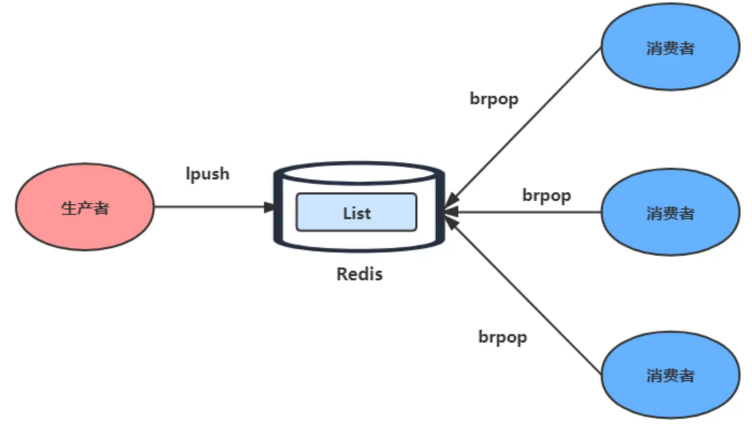

   2. 如何处理重复消费（生产者自行实现全局唯一 ID）

      - 每个消息需要一个全局ID
      - 消费者要记录已经处理过的消息ID，当收到一条消息后，消费者程序就可以对比收到的消息ID和记录的

   3. 如何保证消息可靠性（使用 BRPOPLPUSH）

      当消费者从List中读取一条消息后，List就不会再留存这条消息了，所以如果消费者程序在处理消息的过程中出现了故障或宕机，就会导致消息丢失

      - 使用`BRPOPLPUSH`，这个命令可以让消费者从一个List中读取消息的同时，Redis就会把这个消息再插入到另一个List(可以叫做备份List)留存

2. 弊端

   List不支持多个消费者消费同一条消息，因为一旦消息被一个消费者取出，这条消息就会被消息队列删除，如果要实现一个消息被多个消费者消费，那么就要将多个消费者组成一个消费组，使得多个消费者能消费同一条消息，但List类型并不支持消费组

## 3.hash

hash是由一个键值对(key-value)集合，所以Hash特别适合用于存储对象

string和hash对比

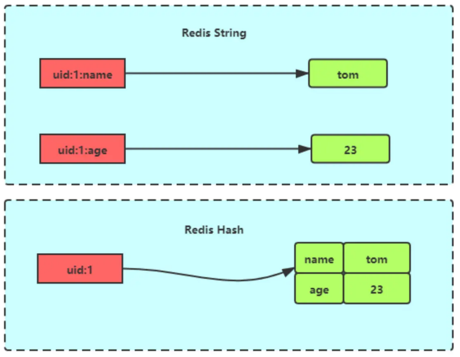

### 底层实现

Hash类型由**压缩链表或哈希表**

- 当元素个数小于512个，所有值小于64字节的话，Redis使用压缩链表作为List的底层结构
- 如果不满足上面条件，Redis会使用哈希表作为hash类型的底层数据结构

**但在Redis7.0版本之后，压缩列表数据结构已经废弃了，交由 listpack 数据结构来实现了**

### 应用场景

1. 缓存对象

   Hash类型适合存储对象，比如用户信息等

   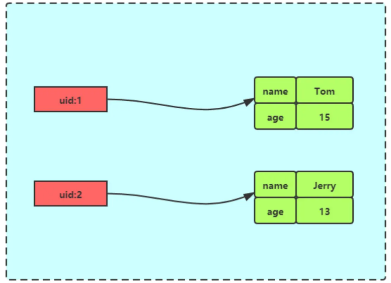

2. 购物车

## 4.Set

Set是一个有序但不允许重复的键值集合，它的存储顺序不会被按照插入的先后顺序进行存储

### 底层实现

Set底层是由**整数集合或哈希表**

- 当元素个数小于512个，所有值小于64字节的话，Redis使用整数集合作为Set的底层结构
- 如果不满足上面条件，则Redis使用哈希表作为Set类型的底层数据结构

### 应用场景

集合的主要特性有：无序、不可重复、支持并集、交集、差集等操作

因此Set适合用来做数据去重和保障数据的唯一性，还可以用来统计多个集合的交集、错集和并集，当我们存储的数据是无序且需要去重的情况下，比较适合使用集合类型来进行存储

但Set 的差、并、交集的计算复杂度高，在数据量较大的情况下，如果直接执行这些计算，会导致Redis实例阻塞，为避免风险出现，可以选择一个从库完成聚合统计，或者把数据返回给客户端，由客户端来完成聚合统计

1. 点赞

   Set类型保证一个用户只能点一个赞

2. 共同关注

   Set类型支持交集运算，所以可以用来计算共同关注的好友、公众号等

3. 抽奖活动

   存储某活动中中奖的用户名，Set类型因为有去重功能，可以保证同一个用户不会中奖两次

## 5.ZSet

Zset类型(有序集合类型)相比于Set类型多了一个排序属性score(分值)，对于有序集合Zset来说，每个存储元素相当于两个值组成的，**一个是有序集合的元素值，一个是值排序**

有序集合保留集合不能有重复元素的特性，但不同的是有序集合中的元素可以排序

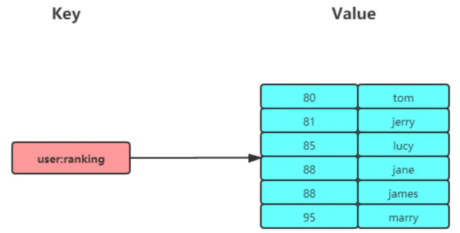

### 底层实现

Zset底层数据结构是由**压缩列表或跳表**

- 当元素个数小于512个，所有值小于64字节的话，Redis使用**压缩列表**
- 如果不满足上面条件，则Redis使用跳表作为Set类型的底层数据结构

**在 Redis 7.0 中，压缩列表数据结构已经废弃了，交由 listpack 数据结构来实现了。**

### 应用场景

Zset类型可以根据元素的权重来排序，我们可以自己来决定每个元素的权重值，比如说，我们可以根据元素插入`Sorted Set`的时间确定权重值，先插入的元素权重小，后插入的元素权重大。

在面对需要展示最新列表、排行榜等场景时，如果数更新频繁或者需要分页显示，可以优先考虑使用`Sorted Set`

1. 排行榜

   有序集合比较经典的适用场景就是排行榜，比如学生成绩排名榜，视频播放榜等

2. 电话姓名排序

   使用有序集合的 `ZRANGEBYLEX` 或 `ZREVRANGEBYLEX` 可以帮助我们实现电话号码或姓名的排序，我们以 `ZRANGEBYLEX` （返回指定成员区间内的成员，按 key 正序排列，分数必须相同）


# 三、Redis数据结构

Redis数据结构并不是指String、List、Hash、Zset、Set这种，因为这些是Redis键值对中值得数据类型，也就是数据的保存形式，这些底层实现的方式就用到了数据结构。

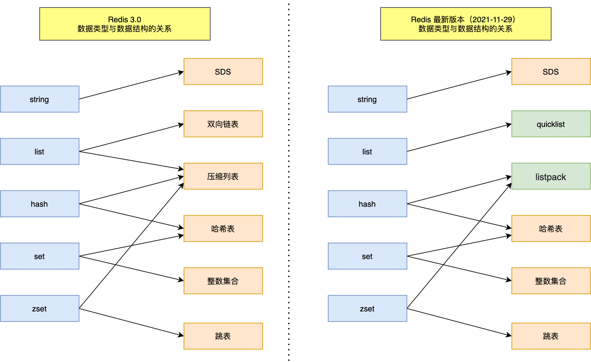

Redis新旧版本的底层数据结构不尽相同，包括有SDS、双向链表、压缩列表、哈希表、跳表、整数集合、quicklist、listpack等。

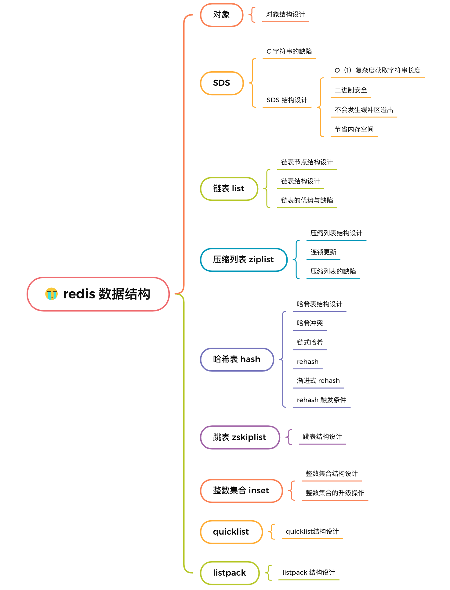

## SDS

Redis是使用C语言实现的，但是没有直接使用`char *`来构建字符串，而是自己封装了SDS(简单动态字符串)

### 1. C语言字符串的缺陷

C语言中`char *`字符数组的最后一位是`'\0'`，因为在C语言中char *指针指向的是字符串的起始地址，而字符串的结尾用'\0'表示，意思是字符串的结束，下面是获取strlen函数的流程

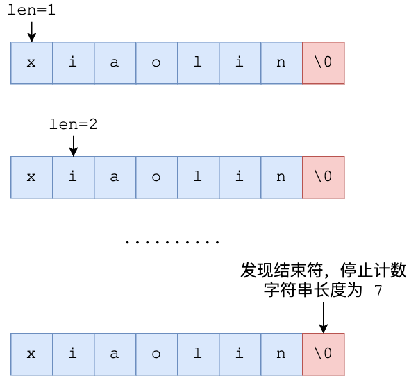

- **时间复杂度为O(n)，此处可改进**

- **除此之外，字符串中不能夹着'\0'不然会被误认为是字符串结尾，这使得C语言的字符串只能保存文本数据，不能保存图片、视频、音频等二进制数据**
- **C语言字符串是不会记录自身缓冲区大小的，在strcat函数假定程序员在执行这个函数时，已经为dest分配了足够多的内存，可以容纳src字符串中的所有内容，一旦这个假定不成立，就会发生缓冲区溢出造成程序运行终止**

### 2. SDS结构设计

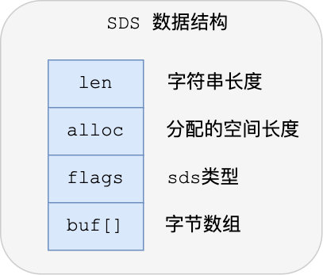

- **Len：记录了字符串长度**。这样获取字符串长度的时候，只需要返回这个成员变量值就行，时间复杂度只需要O(1)
- **alloc：分配给字符数组的空间长度**。这样在修改字符串的时候，可以通过`alloc-len`计算出剩余得到空间大小，可以判断空间是否满足修改需求，如果不满足的话，就会自动将SDS的空间拓展至执行修改所需的大小，然后才执行实际的修改操作，所以使用SDS既不需要手动修改SDS的空间大小，也不会出现缓冲区溢出的问题
- **flags：用来表示不同类型的SDS**。一共设计了5中类型，分别是sdshdr5，sdshdr8,sdshdr16,sdshdr32,sdshdr64，后面再说明区别之处
- **Buf[]：字符数组，用来保存实际数据**。不仅可以保存字符串，也可以保存二进制数据

总的来说，Redis的SDS结构在原本字符串数组之上，增加了三个元数据：len、alloc、flags，用来解决C语言字符串的缺陷问题

1. O(1)时间复杂度获取字符串长度

   Redis的SDS结构因为加入**len成员变量**，那么获取字符串长度的是时候，直接返回这个成员变量的值就行，复杂度就只有O(1)

2. 二进制安全

   **SDS不再需要'\0'字符标识字符串结尾了**，而是有个专门的len成员变量记录长度，**SDS的API都是以处理二进制的方式来处理SDS存放在buf[]里的数据，程序不会对其中的数据做任何限制**，所以Redis不仅可以保存文本数据，也可以保存任何形式的二进制数据

3. 不会发生缓冲区溢出

   C语言的字符串标准库提供的字符串操作函数，大多数都是不安全的。Redis的SDS结构里引入了alloc和len成员变量，这样SDS  API通过alloc-len计算，可以计算出剩余的大小，这样在对字符串进行修改操作的时候，如果缓冲区大小不够用，Redis就会自动扩大SDS的空间大小**【新的总长 = 当前sds长度 + 需要扩容的长度】**

   - 如果所需的sds长度小于1MB，那么最后的扩容是按照翻倍扩容来执行的，即两倍newlen
   - 如果所需的sds长度大于1MB，那么最后的扩容长度是newlen+1MB

4. 节省内存空间

   SDS中的flag成员变量，表示的是SDS类型

   Redis一共设计了5中类型，包括sdshdr5、sdshdr8、sdshdr16、sdshdr32 和 sdshdr64。主要区别在于，它们数据结构中的len和alloc成员变量的数据类型不同

   - **SDS 设计不同类型的结构体，是为了能灵活保存不同大小的字符串，从而有效节省内存空间**
   - 在 struct 声明了 `__attribute__ ((packed))` ，它的作用是：**告诉编译器取消结构体在编译过程中的优化对齐，按照实际占用字节数进行对齐**。

   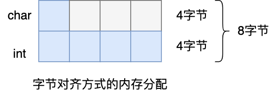

   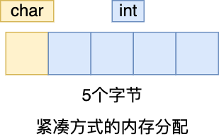

## 链表

C语言本身没有链表这个结构，Redis自己设计了一个，有前置节点和后置节点，**这个是一个双向链表**。

普通的链表节点：

```go
typedef struct listNode {
    //前置节点
    struct listNode *prev;
    //后置节点
    struct listNode *next;
    //节点的值
    void *value;
} listNode;
```

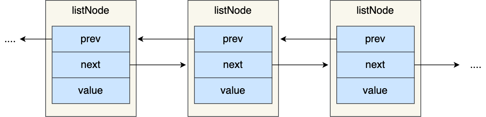

### 1. Redis所自定义的ListNode结构体

```GO
typedef struct list {
    //链表头节点
    listNode *head;
    //链表尾节点
    listNode *tail;
    //节点值复制函数
    void *(*dup)(void *ptr);
    //节点值释放函数
    void (*free)(void *ptr);
    //节点值比较函数
    int (*match)(void *ptr, void *key);
    //链表节点数量
    unsigned long len;
} list;
```

List结构为链表提供了链表头指针head、链表尾节点tail、链表节点数量len、以及可以自定义的dup、free、match函数。

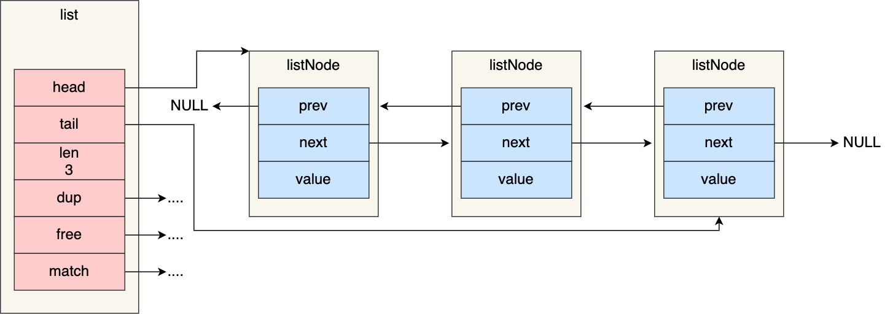

### 2. 链表的优缺点

Redis链表的优点：

1. listNode链表节点的结构体带有Prev和next指针，**获取某个节点的前置节点或后置节点的时间复杂度只需O(1)**，而且这两个指针都可以指向NULL，所以链表是无环链表
2. list结构因为提供了头指针head和尾结点tail，所以**获取链表中的节点数量的时间复杂度只需O(1)**
3. list结构因为提供了链表节点数量len，所以**获取链表中的节点数量的时间复杂度只需O(1)**
4. listNode链表节点使用void*指针保存节点值，并且可以通过list结构的dup、free、match函数指针为节点设置该节点类型特定的函数，因此**链表节点可以保存不同类型的值**

链表的缺陷：

1. 链表每个节点之间的内存都是不连续的，意味着无法很好利用CPU缓存
2. 保存一个链表节点的值都需要一个链表节点结构头的分配，内存开销较大

在Redis3.0的list对象在数据量较少的情况下，会采用**压缩列表**作为其底层结构，优点是节省内存空间， 并且是内存紧凑型的数据结构。但是压缩列表存在性能问题，所以在Redis 3.2版本将List底层数据结构改为**quicklist**实现

## 压缩列表

压缩列表的最大特点，就是他是一种内存紧凑型的数据结构，占用一块连续的内存空间，不仅可以利用CPU缓存，而且会根据不同的长度进行编码，这种方法可以有效的节省内存开销

但是，压缩列表的缺陷也很明显：

1. 不能保存过多的元素， 否则查询效率会很低
2. 新增修改元素时，压缩列表的内存空间需要重新分配，甚至可能引发连锁更新问题

因此，redis对象包含的元素数量较少，或者元素值不大的情况下才会使用压缩列表作为底层数据结构。

### 压缩列表的数据结构

压缩列表时是Redis为了节约内存而开发的，它是由连续内存组成的顺序型数据结构，有点类似数组


压缩列表在表头有三个字段：

- zlbytes：记录整个压缩列表**占用字节数**
- zltail：记录压缩列表**尾部节点距离起始地址**多少字节，也就是尾列表的偏移量
- zllen：记录压缩列表包含的**节点数量**
- zlend：标记压缩列表的结束点，固定值0xFF(十进制255)

### 2. 压缩列表的缺陷

1. 只适合保存节点数量不多的场景

   在压缩列表中，如果我们要查找第一个元素和最后一个元素，可以通过表头三个字段(zllen)的长度直接定位，复杂度是O(1)。而查找其他元素时，就没有这么高效了，只能逐个查找，此时的复杂度就是O(N)了，因此压缩列表不适合保存过多元素。

2. 连锁更新导致连续的多次空间扩展操作

   压缩列表新增某个元素时，如果空间不够，压缩列表占用的内存空间就需要重新分配。而当新插入的元素较大时，可能会导致连锁更新，每个元素占用的空间都需要重新分配，造成访问压缩列表性能的下降。在这种情况下产生的连续多次空间拓展操作就叫连锁更新

## 哈希表

哈希表中每一个key都是独一无二的，程序可以根据key查找到与之关联的value，进行修改或删除等，哈希的优点是查询数据的时间复杂度为O(1)，当时在哈希表大小固定的情况下，随着数据不断增多，那么哈希冲突的可能性也会越高。Redis采用**链式哈希**来解决哈希冲突。

### 1. 哈希表结构设计

```go
typedef struct dictht {
    //哈希表数组
    dictEntry **table;
    //哈希表大小
    unsigned long size;  
    //哈希表大小掩码，用于计算索引值
    unsigned long sizemask;
    //该哈希表已有的节点数量
    unsigned long used;
} dictht;
```

可以看到，哈希表是一个数组(dictEntry **Table)，数组的每个元素是一个指向[哈希表节点(dictEntry)]的指针

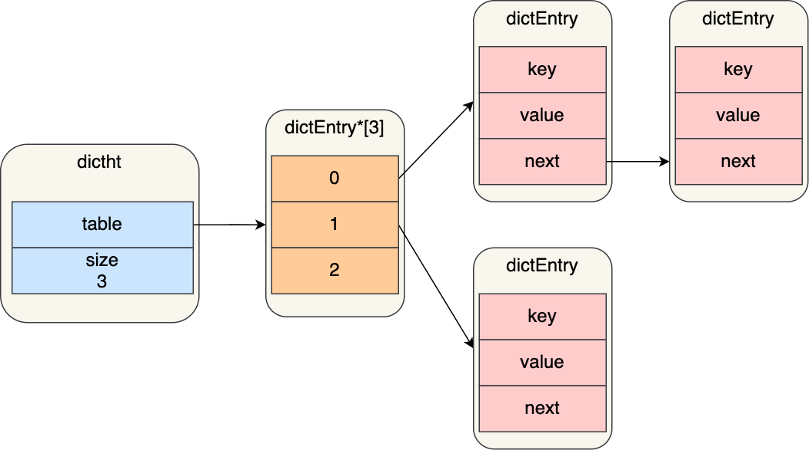

哈希表节点的结构如下：

```go
typedef struct dictEntry {
    //键值对中的键
    void *key;
  
    //键值对中的值
    union {
        void *val;
        uint64_t u64;
        int64_t s64;
        double d;
    } v;
    //指向下一个哈希表节点，形成链表
    struct dictEntry *next;
} dictEntry;
```

dictEntry结构里不仅包含指向键和值的指针，还包含了指向下一个哈希表的指针，这个指针可以将多个哈希值相同的键值对链接起来，以此来解决哈希冲突的问题，这就是链式哈希。

### 2. 哈希冲突

哈希表实际上是一个数组，数组的每一个元素就是一个哈希桶

当一个键值对的键经过Hash函数计算后得到的哈希值，再将(哈希值%哈希表的大小)取模计算，得到的结果值就是该key-value对应的数组元素位置，也就是第几个哈希桶

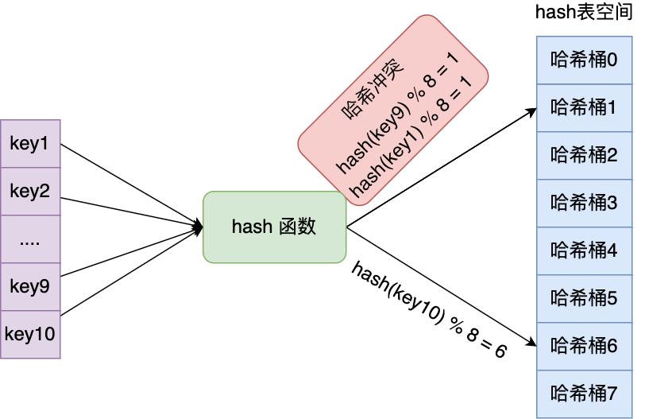

因此key1和key9对应到了相同的哈希桶中，这就发生了哈希冲突

**当有两个以上的数量的key被分配到了哈希表中同一个哈希桶上时，就表示发生了哈希冲突**

#### 1. 链式哈希

每个hash节点都有一个next指针，用于指向像一个哈希表节点，因此多个哈希表可以用next指针构成一个单向链表，**被分配到同一个哈希桶上的多个节点可以用这个单向链表连接起来**，这样就解决了哈希冲突

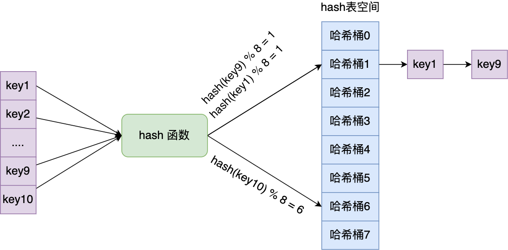

不过，链式哈希的局限性也很明显，随着链表长度增加，查询这一位置的数据的耗时就会增加，毕竟查询的时间复杂度为O(n)，要想解决这一问题，就要进行rehash，也就是对哈希表的大小进行拓展。

#### 2. rehash

Redis使用dictht结构体表示哈希表，不过在使用哈希表时，Redis定义了一个dict结构体，这个结构体定义了**两个哈希表(ht[2])**

```go
typedef struct dict {
    …
    //两个Hash表，交替使用，用于rehash操作
    dictht ht[2]; 
    …
} dict;
```

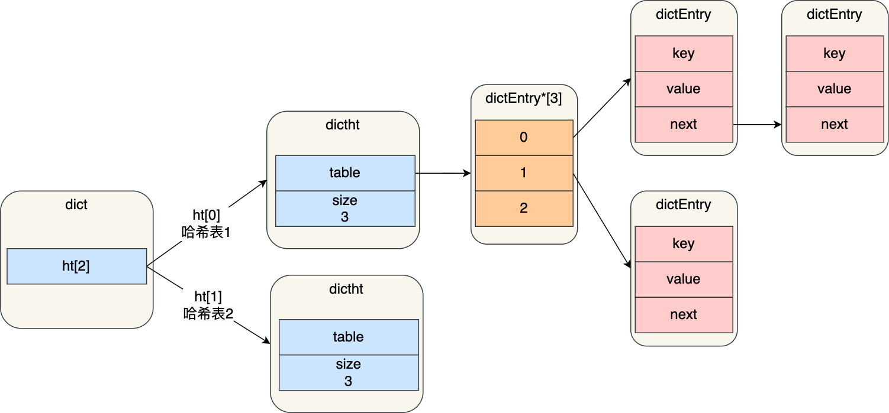

在正常服务请求阶段，插入的数据，都会写入到「哈希表 1」，此时的「哈希表 2」并没有被分配空间，随着数据增多，出发了rehash操作，这个过程分三步

- 给「哈希表 2」分配空间，一般会比「哈希表 1」大2倍
- 将「哈希表 1」的数据迁移到「哈希表 2」中
- 迁移完成后，「哈希表 1」的空间会被释放，并把「哈希表 2」设置为「哈希表 1」，然后在「哈希表 2」新创建一个空白的哈希表，为下次rehash做准备


这个过程看起来很简单，但是其实第二步问题很大，如果「哈希表 1」的数据量非常大，那么在迁移至「哈希表 2 」的时候，因为会涉及大量的数据拷贝，此时可能会对Redis造成阻塞，无法服务其他请求

#### 3. 渐进式rehash

为了避免rehash在数据迁移过程中，因拷贝数据的耗时，影响Redis性能的情况，采用渐进式rehash，也就是数据的迁移工作不是一次性完成，而是分成多次了

步骤如下：

- 给哈希表2分配空间
- 在rehash期间，每次哈希表元素进行新增、删除、查找或者更新操作时，Redis除了会执行对应的操作之外，还会顺序将哈希表1中索引位置上所有的key-value转移到哈希表2上
- 随着处理客户端发起的哈希表操作请求数量越来越多，最终在某个时间点会把哈希表1的所有key-value迁移到哈希表2，从而完成rehash操作

在进行渐进式 rehash 的过程中，会有两个哈希表，所以在渐进式 rehash 进行期间，哈希表元素的删除、查找、更新等操作都会在这两个哈希表进行。

比如，查找一个 key 的值的话，先会在「哈希表 1」 里面进行查找，如果没找到，就会继续到哈希表 2 里面进行找到。

另外，在渐进式 rehash 进行期间，新增一个 key-value 时，会被保存到「哈希表 2 」里面，而「哈希表 1」  则不再进行任何添加操作，这样保证了「哈希表 1 」的 key-value 数量只会减少，随着 rehash 操作的完成，最终「哈希表 1  」就会变成空表。

#### 4. rehash触发条件


触发rehash操作的条件主要有以下两个

- 负载因子大于等于1时，并且Redis没有执行bgsave或bgrewiteaof命令，也就是没有执行RDB快照或没有进行AOF重写的时候，就会进行rehash操作
- 当负载因子大于等于5时，此时说明哈希冲突非常严重了，不管有没有在执行RDB快照或者AOF重写，都会强制执行rehash操作

## 整数集合

整数集合是Set对象的底层实现之一，当一个Set对象只包含整数值元素，并且元素数量不大时，就会使用整数集这个数据结构作为底层实现

### 整数集合结构设计

```go
typedef struct intset {
    //编码方式
    uint32_t encoding;
    //集合包含的元素数量
    uint32_t length;
    //保存元素的数组
    int8_t contents[];
} intset;
```

## 跳表

Redis只有ZSet对象的底层实现用到了跳表，跳表的优势是能支持平均O(logN)复杂度的节点查找

zset结构体里只有两个数据结构，一个是跳表，一个是哈希表，这样的好处是既能进行高效的范围查找，也能进行搞笑的单点查询

```go
typedef struct zset {
    dict *dict;
    zskiplist *zsl;
} zset;
```

Zset对象在执行数据插入或者数据更新的过程中，会一次在跳表和哈希表中插入或更新对应的数据，从而保证了跳表和哈希表中记录的信息一致

Zset对象能够支持范围查询，这是因为他的数据结构采用了跳表，而又能以常数复杂度获取元素权重，这是因为采用了哈希表进行索引，但是也只有获取元素权重时才使用哈希表来操作，其他操作都是基于跳表

### 1. 跳表结构设计

链表在查找元素的时候，因为需要逐一查找，所以查询效率很低，时间复杂度为O(N)，于是出现了跳表，跳表是在链表的基础上改进过来的，实现了一种多层的有序链表，这样的好处是能够快读定位数据

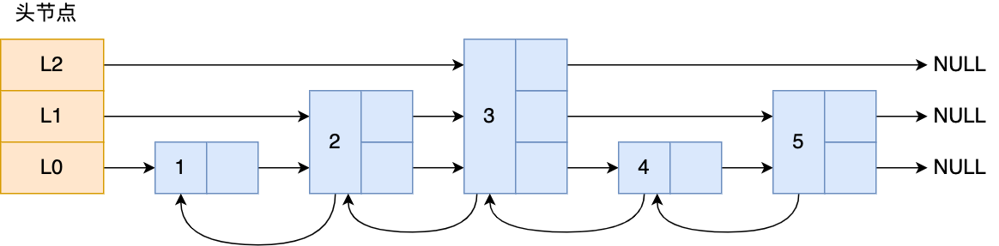

如果我们要在链表中查找节点 4 这个元素，只能从头开始遍历链表，需要查找 4 次，而使用了跳表后，只需要查找 2 次就能定位到节点 4，因为可以在头节点直接从 L2 层级跳到节点 3，然后再往前遍历找到节点 4。

可以看到，这个查找过程就是在多个层级上跳来跳去，最后定位到元素。当数据量很大时，跳表的查找复杂度就是 O(logN)。

```go
typedef struct zskiplistNode {
    //Zset 对象的元素值
    sds ele;
    //元素权重值
    double score;
    //后向指针
    struct zskiplistNode *backward;
    
    //节点的level数组，保存每层上的前向指针和跨度
    struct zskiplistLevel {
        struct zskiplistNode *forward;
        unsigned long span;
    } level[];
} zskiplistNode;
```

sds类型的ele变量代表Zset对象的元素，double类型的score代表元素的权重。每一个跳表节点都有一个后向指针(struct  zskiplistNode *backward)，指向前一个检点，目的是为了方便从跳表的尾结点开始访问节点，这样倒序查找时很方便。

跳表是一个带有层级关系的链表，而且每一级可以包含多个节点，每个节点通过指针连接起来，实现这一特性就是靠跳表节点结构体重的zskiplistLevel结构体类型的level数组。

level数组中的每一个元素代表跳表的一层，也就是由zskiplistLevel结构体标识，比如level[0]表示第一层，level[1]表示第二层，zskiplistLevel结构体定义了「指向下一个跳表节点的指针」和「跨度」,跨度用来记录两个节点之间的距离，**跨度实际上是为了计算这个节点在跳表中的排位**


```go
typedef struct zskiplist {
    struct zskiplistNode *header, *tail;
    unsigned long length;
    int level;
} zskiplist;
```

跳表结构里包含了：

- 跳表的头尾节点，便于在O(1)时间复杂度内访问跳表的头节点和尾节点；
- 跳表的长度，便于在O(1)时间复杂度获取跳表节点的数量；
- 跳表的最大层数，便于在O(1)时间复杂度获取跳表中层高最大的那个节点的层数量；

 
