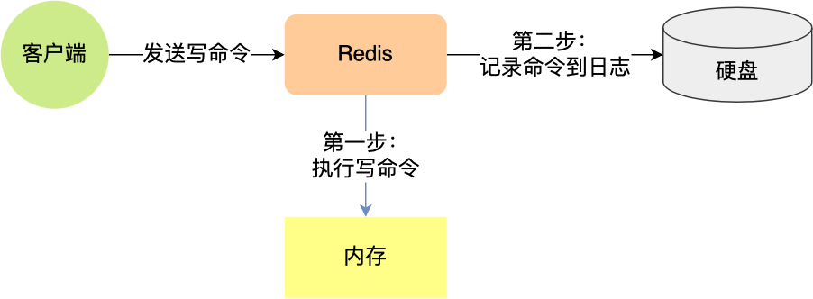
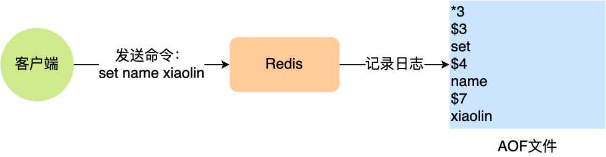
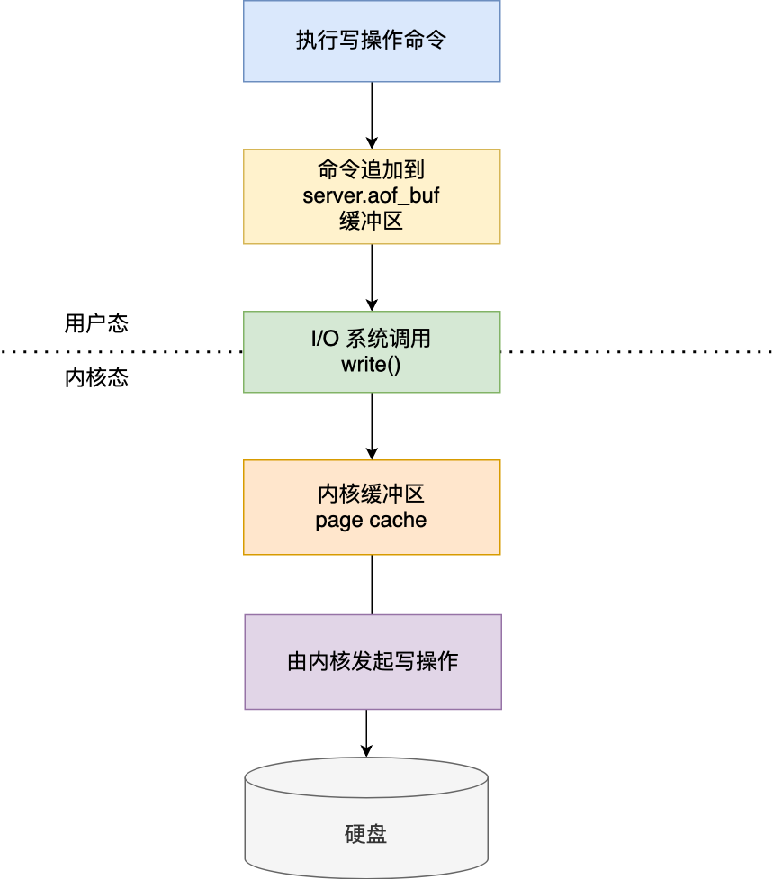
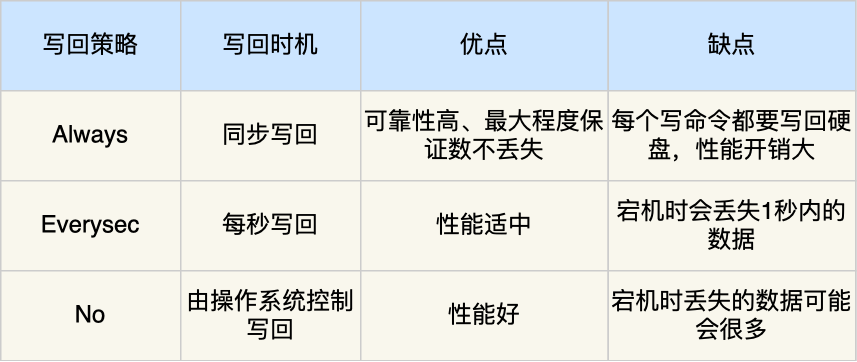

# 持久化

## 1. AOF持久化

**AOF 文件的内容是操作命令**



这种保存写操作命令到日志的持久化方式，就是AOF持久化方式（只记录写，不记录读）

Redis中AOF持久化功能默认是不开启的，需要修改`redis.conf`配置文件的参数：


### 1. AOF日志内容样例



「`*3`」表示当前命令有三个部分，每部分都是以「`$+数字`」开头，后面紧跟着具体的命令、键或值。然后，这里的「`数字`」表示这部分中的命令、键或值一共有多少字节。例如，「`$3 set`」表示这部分有 3 个字节，也就是「`set`」命令这个字符串的长度。

### 2. Redis是先执行写操作后，才将命令记录到AOF日志内，这样做有两个好处

1. 避免额外的检查开销

   如果先记录，那么可能会把没有经过命令语法检查的命令记录到AOF日志，在Redis使用AOF恢复时就可能会出错，所以应该先执行，保证执行成功的命令才会被记录

2. 不会阻塞当前写操作命令的执行

### 3. AOF持久化的风险

1. 执行写操作命令和记录日志是两个过程，那当Redis在还没来得及将命令写入到磁盘时，服务器发生宕机了，这个**数据就会有丢失的风险**
2. 写操作命令执行成功后才记录到AOF日志，所以不会阻塞当前写操作执行，但是可能会给**下一个命令带来风险**

### 4. 三种写回策略



Redis写入AOF日志的过程：

1. Redis执行完写操作后，会把命令追加到`server.aof_buf`缓冲区
2. 通过write()系统调用，将aof_buf缓冲区的数据写入到AOF文件，此时数据并没有写入到硬盘，而是拷贝到了内核缓冲区page cache，等待内核将数据写入硬盘
3. 具体内核缓冲区的数据什么时候写入硬盘，由内核决定

内核写磁盘的三种策略是在`redis.conf`配置文件中的`appendfsync`配置项修改的：

- Always：「总是」,每次写操作命令执行完成后，同步将AOF日志数据写回硬盘
- Everysec：「每秒」每次写操作命令执行完成后，先将数据写入AOF文件的内核缓冲区，然后每隔一秒将缓冲区里的内容写回到磁盘
- No：「由操作系统决定」每次写操作命令执行完成后，先将数据写入AOF文件的内核缓冲区，再由操作系统决定何时将缓冲区内容写回硬盘



### 5. AOF重写机制

当Redis重启时，需要读AOF文件的内容以恢复数据，如果文件过大，恢复的过程就会很慢，带来性能问题。

AOF重写机制就是在重写时，读取当前数据库中所有键值对，然后将每一个键值对用一条命令记录到新的AOF文件，等到全部记录完后，就将新的AOF文件替换现有的AOF文件。

重写机制的妙处在于，尽管键值对被多条写命令反复修改，**最终也只需要根据这个「键值对」当前的最新状态，然后用一条命令去记录键值对**，替代之前记录这个键值对的多条命令，这样就减少了AOF文件中的命令数量，最后在重写工作完成后，将新的AOF文件覆盖现有的AOF文件。

Q：为什么重写的时候，不直接复用现有的AOF文件，而是先写道新的AOF文件再覆盖过去？

A：因为如果AOF重写失败了，现有的AOF文件就会被污染，可能无法用于恢复使用

## 2. RDB快照

RDB 文件的内容是二进制数据，记录某一瞬间内存的实际数据

### 1. 如何生成RDB

Redis提供了两个命令生成RDB文件，分别是`save`和`bgsave`

1. 执行`save`命令，就会在`主线程生成RDB文件`，由于和执行操作命令在同一个线程，所以如果写入RDB文件的时间太长，就会阻塞主线程
2. 执行`bgsave`命令，会创建一个`子进程来生成RDB文件`，这样可以避免主线程的阻塞

RDB是全量快照，每次执行快照，会把内存中`所有数据`都记录到磁盘中

### 2. RDB快照的缺点

RDB是每次间隔一段时间进行一次全量快照，如果执行太频繁会影响Redis性能，但如果执行间隔较长，在服务器发生故障时，丢失的数据会比AOF持久化的方式更多

Q：执行快照时，数据能被修改的吗？

A：可以，写时复制技术

## 3. 混合持久化

修改Redis配置来开启混合持久化

```
aof-use-rdb-preamble yes
```

混合持久化发生在AOF日志重写过程：

当开启了混合持久化，在AOF重写日志时，`fork`出来的重写子进程会先将与主线程共享的内存数据以RDB方式写入到AOF文件，然后主线程处理的操作命令会被记录在重写缓冲区里，重写缓冲区里的增量命令会以AOF方式写入到AOF文件，写入完成后通知主进程将新的含有RDB格式和AOF格式的AOF文件替换旧的AOF文件

```
实际数据RDB->写入AOF文件->主线程的操作命令写入缓冲区AOF->AOF文件->共同写入AOF->替换旧AOF
```

就是说，使用了混合持久化，AOF文件的前半部分是RDB格式的全量数据，后半部分是AOF格式的增量数据


这样的好处在于，重启Redis加载数据的时候，由于前半部分是RDB内容，这样加载的速度就会很快，加载完RDB内容后，才会加载后半部分的AOF内容，这里的内容是Redis后台子进程重写AOF期间，主线程处理的操作命令，可以使得数据更少的丢失

### 4. Redis大key对AOF日志的影响

### 1. 对于AOF持久化三种策略的影响

1. **当使用 Always 策略的时候，如果写入是一个大 Key，主线程在执行 fsync() 函数的时候，阻塞的时间会比较久，因为当写入的数据量很大的时候，数据同步到硬盘这个过程是很耗时的**。

1. 当使用 Everysec 策略的时候，由于是异步执行 fsync() 函数，所以大 Key 持久化的过程（数据同步磁盘）不会影响主线程。

1. 当使用 No 策略的时候，由于永不执行 fsync() 函数，所以大 Key 持久化的过程不会影响主线程

AOF重写机制和RDB快照的过程，都会分别通过fork()函数创建一个子进程来处理任务，会有两个阶段会导致阻塞父进程

- 创建子进程时，由于要复制父进程的页等数据结构，阻塞的时间和页面的大小有关，页表越大，阻塞时间越长
- 创建完子进程后，如果父进程修改了共享数据中的大key，就会发生写时复制，这期间拷贝物理内存，由于大key占用的物理内存会很大，所以在复制物理内存这一过程就会比较耗时，所以有可能会阻塞父进程

### 2. 大key除了会影响持久化之外，还会有以下影响

- **客户端超时阻塞**，由于Redis执行命令是单线程处理的，然后在操作大key时会比较耗时，那么就会阻塞Redis
- **引发网络阻塞**，每次获取大key产生的网络流量较大，如果一个key的大小是1MB，每次访问量为1000，那么每秒会产生1000MB的流量，这对于普通千兆网卡的服务器来说是灾难性的
- **阻塞工作线程**，如果使用del删除大key时，会阻塞工作线程，这样就没办法处理后续的命令
- **内存分配不均**，集群模型在slot分片均匀的情况下，会出现数据和查询倾斜的情况，部分有大key的Redis节点占用内存多，QPS也会比较大

### 3. 如果避免大key

就会把大key拆分一个一个小key，或者定时检查Redis是否存在大Key。或者，定时检查Redis是否存在大key，如果该大key是可以删除的，不要使用Del命令删除，因为该命令删除过程中会造成阻塞主线程，使用unlink命令删除大key，因为该命令的删除过程是异步的，不会阻塞主线程。

# Redis过期删除策略

Redis 是可以对 key 设置过期时间的，因此需要有相应的机制将已过期的键值对删除，而做这个工作的就是过期键值删除策略。

## 1. 如何设置过期时间？

------

### 1. 对 key 设置过期时间的命令

1. `expire <key> <n>`：**设置 key 在 n 秒后过期**，比如 expire key 100 表示设置 key 在 100 秒后过期；
2. `pexpire <key> <n>`：**设置 key 在 n 毫秒后过期**，比如 pexpire key2 100000 表示设置 key2 在 100000 毫秒（100 秒）后过期。
3. `expireat <key> <n>`：**设置 key 在某个时间戳（精确到秒）之后过期**，比如 expireat key3 1655654400 表示 key3 在时间戳 1655654400 后过期（精确到秒）；
4. `pexpireat <key> <n>`：**设置 key 在某个时间戳（精确到毫秒）之后过期**，比如 pexpireat key4 1655654400000 表示 key4 在时间戳 1655654400000 后过期（精确到毫秒）

### 2. 设置字符串时，也可以同时对 key 设置过期时间

1. `set <key> <value> ex <n>` ：设置键值对的时候，同时指定过期时间（精确到秒）；
2. `set <key> <value> px <n>` ：设置键值对的时候，同时指定过期时间（精确到毫秒）；
3. `setex <key> <n> <valule>` ：设置键值对的时候，同时指定过期时间（精确到秒）。

`TTL <key>`查看某个 key 剩余的存活时间

`PERSIST <key>` 取消 key 的过期时间，则可以使用

## 2. 过期删除策略

### 1. 定时删除

**在设置 key 的过期时间时，同时创建一个定时事件，当时间到达时，由事件处理器自动执行 key 的删除操作**。

优点：

保证过期的key立刻删除，内存会第一时间
